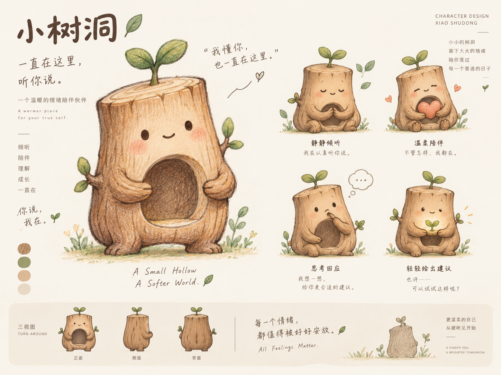

# 研压树洞

> 我懂你，也一直在这里。

研压树洞是一款面向研究生压力场景的 AI 情绪陪伴 Web 应用。它不会把用户放进生硬的情绪标签或流程里，而是通过自然对话、角色动作和轻量选择，让用户决定此刻更需要被倾听、一起梳理，还是共同寻找下一步。

<p align="center">
  
</p>

## 界面效果

### 陪伴首页

- 固定 Slogan：**“我懂你，也一直在这里”**
- 根据时间显示日常问候
- 支持直接输入，不强制选择模式
- 提供三种自然语言陪伴入口：
  - 我只是想说说
  - 陪我理一理
  - 一起想想办法
- 展示最近一次对话和自然的长期关系提示
- 小树洞角色以中等视觉比重陪伴用户，不遮挡主要内容

### 聊天页面

- 对话内容保持为页面主体
- 小树洞固定在侧边或移动端顶部
- 通过角色动作和自然语言表达当前陪伴方式
- 不展示“情绪识别结果”“置信度”或 Agent 执行流程
- 用户可以随时选择：
  - 继续和我说说
  - 陪我理一理
  - 一起想想办法

## 小树洞的五种状态

| 状态 | 角色表现 | 页面表达 |
| --- | --- | --- |
| 待机 | 轻微呼吸、缓慢上浮 | 我在这里，等你慢慢开口 |
| 倾听 | 安静合手、轻微点头 | 我正在听你说 |
| 思考 | 手靠近嘴边、轻轻侧身 | 我在想怎么回应你 |
| 陪伴 | 抱着暖色爱心、柔和呼吸 | 陪你慢慢理一理 |
| 给建议 | 双手托起嫩芽 | 要不要一起想想怎么办？ |

五种状态均使用独立透明角色图，并通过 CSS 微动画呈现。动画保持克制，不使用游戏化转场。

## 核心功能

- **流式 AI 对话**：通过 DeepSeek 接口逐步返回回复
- **三种陪伴方向**：倾听、梳理和行动建议可由用户自然切换
- **场景理解**：围绕科研、导师沟通和未来选择等研究生常见压力展开
- **短期记忆**：在同一会话内保留稳定信息和未完成事项
- **本地回退回复**：接口超时或网络异常时仍能继续基本对话
- **安全路由**：高风险表达优先进入安全支持，不继续普通建议流程
- **响应式设计**：支持桌面端、平板和移动端
- **减少动态效果支持**：遵循系统的减少动画设置

## 快速开始

### 环境要求

- Node.js 18 或更高版本
- DeepSeek API Key

### 1. 安装依赖

```bash
npm install
```

### 2. 配置环境变量

复制示例文件：

```powershell
Copy-Item .env.example .env
```

编辑 `.env`：

```env
DEEPSEEK_API_KEY=你的_DeepSeek_API_Key
DEEPSEEK_MODEL=deepseek-chat
```

真实的 `.env` 和 `.env.local` 已被 Git 忽略，不应上传到公开仓库。

### 3. 启动项目

```bash
npm start
```

打开：

```text
http://127.0.0.1:4174/
```

### 4. 运行测试

```bash
npm test
```

## 部署到 Vercel

项目已包含 `vercel.json` 和 `api/` Serverless Functions。

1. 在 Vercel 中导入本 GitHub 仓库
2. Framework Preset 选择 **Other**
3. Build Command 和 Output Directory 保持为空
4. 添加环境变量：

   ```text
   DEEPSEEK_API_KEY=你的 DeepSeek API Key
   DEEPSEEK_MODEL=deepseek-chat
   ```

5. 部署后访问 `/api/health`，确认 `keyConfigured` 为 `true`

## 项目结构

```text
.
├── index.html                 # 首页与聊天页
├── styles.css                # 视觉系统、响应式布局和角色动画
├── script.js                 # 页面交互、状态切换和流式对话
├── evaluation.js             # 对话评测辅助逻辑
├── assets/
│   ├── README.md             # 角色资源说明
│   ├── treehole-character-sheet.png
│   ├── treehole-idle-v3.png
│   ├── treehole-listening-v3.png
│   ├── treehole-thinking-v3.png
│   ├── treehole-companion-v3.png
│   └── treehole-suggestion-v3.png
├── api/
│   ├── chat/stream.js        # Vercel 流式对话接口
│   ├── events.js             # 隐私安全的事件接口
│   └── health.js             # 服务健康检查
├── lib/                      # 路由、安全、记忆、验证和提示词逻辑
├── tests/                    # 自动化测试
├── server.example.js         # 本地开发服务器
├── package.json
├── vercel.json
└── render.yaml
```

## 技术方案

- 前端：原生 HTML、CSS、JavaScript
- 本地服务：Node.js
- 模型接口：DeepSeek 流式 API
- 部署：Vercel Serverless Functions 或 Render
- 数据策略：无账号系统，不在浏览器中保存 API Key
- 会话记忆：服务进程内短期记忆，支持过期与容量限制
- 稳定性：超时控制、一次重试、本地回复回退

## 安全与使用边界

研压树洞提供情绪支持，但不替代心理咨询、精神科诊疗或紧急救助。

当用户表达自伤、自杀或现实危险倾向时，系统会优先进入安全支持路径，停止普通建议流程，并鼓励用户尽快联系可信任的人、专业机构或当地紧急服务。
